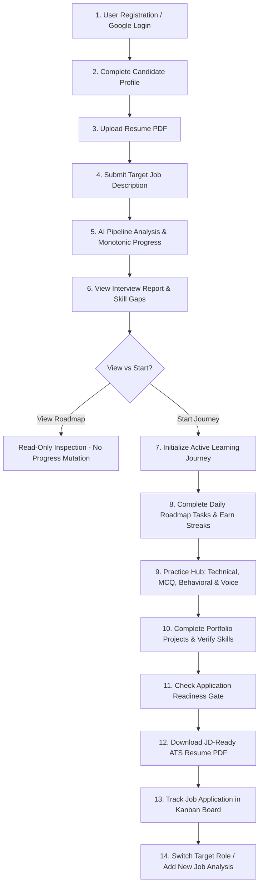
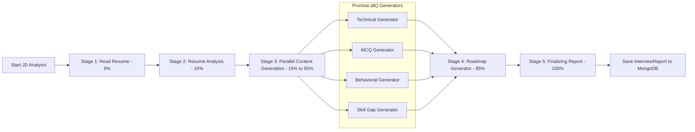

# StudentSkillHub

> **Learn. Practice. Build. Get Hired.**

StudentSkillHub is a comprehensive, production-ready AI-assisted student career platform that bridges the gap between candidate resumes and target job descriptions. The platform transforms raw job postings into personalized preparation roadmaps, interactive practice sessions, role-specific project recommendations, evidence-based readiness assessments, and ATS-tailored resume generation in a unified workflow.

---

## 📋 Table of Contents

- [Overview](#-overview)
- [Key Features](#-key-features)
- [Complete Candidate User Journey](#-complete-candidate-user-journey)
- [System Architecture](#-system-architecture)
- [Technology Stack](#-technology-stack)
- [Database Schema & Models Inventory](#-database-schema--models-inventory)
- [API Endpoint Catalog](#-api-endpoint-catalog)
- [Environment Configuration & Setup](#-environment-configuration--setup)
- [Local Development Guide](#-local-development-guide)
- [Testing & Quality Assurance](#-testing--quality-assurance)
- [Production Build & Deployment](#-production-build--deployment)
- [Security & User Isolation](#-security--user-isolation)
- [Troubleshooting & FAQ](#-troubleshooting--faq)
- [License](#-license)

---

## 🎯 Overview

Students and job seekers face a major challenge in modern technical hiring: **knowing exactly what skills they lack for a specific role and how to bridge those gaps effectively**.

StudentSkillHub solves this by providing:
1. **Automated JD Track & Skill Analysis**: Parses candidate resumes alongside targeted job descriptions to identify single or multi-track roles, ATS match percentages ($0-100\%$), and structured skill classifications ($\text{Present}$, $\text{Partially Demonstrated}$, $\text{Not Demonstrated}$, $\text{Missing}$).
2. **Structured Preparation Roadmaps**: Generates custom 7, 15, or 20-day structured roadmaps with daily study tasks, expected outcomes, and curated learning resources.
3. **Active Learning Journeys & Streak Tracking**: Allows candidates to activate roadmaps as persistent Learning Journeys with real-time day/task completion tracking, active study time logs, and verifiable learning streaks.
4. **Multi-Format AI Practice Hub**: Features Technical Question Drilldowns (20 Qs with difficulty tiers & follow-ups), Multiple-Choice Quizzes (15 Qs with explanations), STAR Behavioral Drills (10 Qs grounded in candidate experience), and Voice Practice with audio transcript evaluation.
5. **Application Readiness Gate & JD-Ready Resumes**: Evaluates candidate readiness using an 8-point evidence matrix and compiles ATS-tailored LaTeX/PDF resumes downloadable via authenticated endpoints.
6. **Kanban Application Tracker & Target Switcher**: Manages job application pipelines (`SAVED`, `PREPARING`, `READY_TO_APPLY`, `APPLIED`, `INTERVIEW`, `OFFER`) and enables seamless target role switching with state sequence protection.

---

## ✨ Key Features

### 1. Career Analysis & JD Track Detection
- **Multi-Track Role Parsing**: Detects postings containing multiple distinct sub-roles (e.g. *Full Stack Developer* vs *AI/ML Intern*) within a single job description.
- **ATS Match Score & Keyword Audit**: Calculates ATS compatibility percentages ($0-100\%$) and classifies keywords into matched, strong, weak, and missing lists.
- **Requirement Classification Balance**: Enforces the mathematical invariant:
  $$\text{Present} + \text{Partial} + \text{Not Demonstrated} + \text{Missing} = \text{Total Requirements}$$

### 2. Roadmaps & Active Learning Journeys
- **Dynamic Curriculum Duration**: Supports 7, 15, or 20-day preparation roadmaps tailored to the target job description.
- **Roadmap View vs. Journey Activation**:
  - *Viewing a Roadmap*: Read-only inspection of curriculum days. Does **NOT** mutate database state, increment streaks, or log study time.
  - *Starting a Learning Journey*: Initializes a persistent `LearningJourney` record, sets status to `ACTIVE`, and begins tracking daily completed tasks.
- **Day & Task Checklist**: Interactive checklist per roadmap day with real-time progress calculations and daily streak rewards.

### 3. Practice Hub & Focus Session Studio
- **Technical Practice (20 Questions)**: Divided across Easy, Medium, and Hard difficulty levels. Includes interviewer intention, common candidate mistakes, follow-up questions, and learning resources.
- **MCQ Practice (15 Questions)**: 4 distractor options per question with 1 verified correct answer key and explanations.
- **STAR Behavioral Practice (10 Questions)**: Situation, Task, Action, Result structured questions grounded in candidate profile evidence.
- **Voice Practice & Audio Transcripts**: Browser audio recording with speech-to-text transcript processing and AI feedback.

### 4. Skill Hub & Project Recommendations
- **Skill Gap Severity**: Classifies skill gaps by severity level (*Critical*, *Moderate*, *Low*) with estimated learning hours and recommended topics.
- **Role-Specific Project Recommendations**: Recommends real-world portfolio projects specifically mapped to candidate skill gaps.

### 5. Application Readiness Gate & PDF Resume Streaming
- **Readiness Matrix**: Evaluates pre-application readiness across 8 metrics (JD Match, Verified Skills, Roadmap Days, Technical Practice, Behavioral Practice, Projects, Profile Strength, Resume Alignment).
- **Authenticated PDF Download**: Streams ATS-tailored PDF resumes directly via `POST /api/interview/resume/pdf/:interviewReportId` with `Content-Type: application/pdf`.

### 6. Job Application Tracker & Target Switcher
- **Kanban Application Board**: Tracks applications across `SAVED`, `PREPARING`, `READY_TO_APPLY`, `APPLIED`, `INTERVIEW_SCHEDULED`, `INTERVIEW_COMPLETED`, `OFFER`, and `REJECTED`.
- **Target Switcher Portal**: Switch between active job targets with race condition sequence protection (`switchSeqRef`).

---

## 🔄 Complete Candidate User Journey



---

## 🏗️ System Architecture

### High-Level Architecture Diagram

```mermaid
flowchart TB
    subgraph Frontend ["React 19 + Vite 7 Client"]
        UI[AppShell & Layout]
        ROUTER[React Router 7]
        CONTEXT[Interview & Auth Context]
        API_CLIENT[Axios HTTP Client]
    end

    subgraph Backend ["Node.js + Express 5 API"]
        AUTH_MW[JWT Auth Middleware]
        CTRL[Controllers Layer]
        SERVICES[Business Logic Services]
        PARSER[PDF Parser & Formatter]
        PDF_GEN[Puppeteer PDF Generator]
    end

    subgraph AI_Engine ["Google Gemini AI Pipeline"]
        CLIENT[@google/genai SDK]
        TRACKER[Monotonic Progress Tracker]
        SCHEMAS[Zod Structured Output Schemas]
        GEN[Parallel Generators: Tech, MCQ, STAR, Gaps, Roadmap]
    end

    subgraph Storage ["Database Layer"]
        MONGO[(MongoDB + Mongoose 9)]
    end

    UI --> ROUTER
    ROUTER --> CONTEXT
    CONTEXT --> API_CLIENT
    API_CLIENT -->|HTTPS / REST| AUTH_MW
    AUTH_MW --> CTRL
    CTRL --> SERVICES
    SERVICES --> MONGO
    SERVICES --> PARSER
    SERVICES --> PDF_GEN
    SERVICES --> CLIENT
    CLIENT --> TRACKER
    CLIENT --> SCHEMAS
    CLIENT --> GEN
```

### AI Pipeline & Progress Tracking Flow



---

## 🛠️ Technology Stack

### Frontend Architecture
- **Framework**: React 19 (`react`, `react-dom`)
- **Build Tool & Dev Server**: Vite 7 (`vite`, `@vitejs/plugin-react`)
- **Routing**: React Router 7 (`react-router`)
- **State Management**: React Context API (`AuthContext`, `InterviewContext`)
- **HTTP Client**: Axios (`axios`) with request/response interceptors
- **Icons & UI Primitives**: Lucide React (`lucide-react`)
- **Animations & Motion**: Framer Motion (`framer-motion`)
- **Notifications**: React Hot Toast (`react-hot-toast`)
- **Styling**: Vanilla SCSS (`sass`) using modular variables and design tokens (`designTokens.scss`)

### Backend Architecture
- **Runtime & Framework**: Node.js (v18+) with Express 5 (`express`)
- **Database ODM**: Mongoose 9 (`mongoose`) connecting to MongoDB
- **Authentication**: JSON Web Tokens (`jsonwebtoken`), HTTP-only cookies (`cookie-parser`), password hashing (`bcryptjs`), Google Auth Library (`google-auth-library`)
- **File Processing**: Multer (`multer`) for file uploads, `pdf-parse` for PDF text extraction
- **PDF Generation**: Puppeteer (`puppeteer`) headless Chrome PDF compilation
- **Schema Validation**: Zod 3 (`zod`, `zod-to-json-schema`)
- **Security & CORS**: CORS (`cors`), Dotenv (`dotenv`)

### AI Integration
- **SDK**: Official Google Gen AI SDK (`@google/genai`)
- **Models**: Google Gemini 3.5 Flash-Lite & Gemini 3.5 Flash (`models/gemini-3.5-flash-lite`)
- **Structured Outputs**: Zod JSON Schema enforcement for deterministic AI responses
- **Execution Pattern**: Stage-based progress tracker (`progressTracker.js`) with parallel generation (`Promise.all`) and exponential backoff retries

---

## 🗄️ Database Schema & Models Inventory

| Model | Schema File | Description & Key Fields |
| :--- | :--- | :--- |
| `User` | `user.model.js` | Candidate credentials (`email`, `password` hashed, `name`, `username`, `googleId`, `avatar`). |
| `Profile` | `profile.model.js` | Structured candidate profile (`user`, `bio`, `targetRole`, `skills`, `languages`, `education`, `experience`, `projects`, `certifications`). |
| `InterviewReport` | `interviewReport.model.js` | Complete AI report (`user`, `title`, `company`, `matchScore`, `summary`, `strongSkills`, `weakSkills`, `missingKeywords`, `atsAnalysis`, `skillClassification`, `technicalQuestions`, `mcqQuestions`, `behavioralQuestions`, `skillGaps`, `preparationPlan`, `recommendedProjects`). |
| `LearningJourney` | `journey.model.js` | Active learning roadmap (`user`, `reportId`, `targetRole`, `company`, `status` `ACTIVE`/`COMPLETED`, `currentDay`, `roadmapDays`, `overallProgress`, `completedDays`, `dayProgress`, `completedAt`). |
| `Progress` | `progress.model.js` | Real-time generation progress record (`user`, `progress` %, `status`, `stage`, `stages` flags). |
| `JobApplication` | `application.model.js` | Job tracker entry (`user`, `journeyId`, `reportId`, `company`, `role`, `status`, `jobUrl`, `notes`, `timeline`). |
| `PracticeSession` | `practiceSession.model.js` | Practice hub attempt (`user`, `reportId`, `type` `TECHNICAL`/`MCQ`/`BEHAVIORAL`, `questions`, `answers`, `score`, `transcript`, `aiFeedback`). |

---

## 📡 API Endpoint Catalog

### 1. Authentication API (`/api/auth`)
- `POST /api/auth/register` — Register new user account.
- `POST /api/auth/login` — Authenticate user and issue JWT token.
- `POST /api/auth/google` — Authenticate via Google OAuth credential.
- `GET /api/auth/me` — Fetch currently authenticated user session.
- `POST /api/auth/logout` — Clear auth cookie and end session.

### 2. Interview & AI Analysis API (`/api/interview`)
- `POST /api/interview/detect-tracks` — Analyze JD for multi-track sub-roles.
- `POST /api/interview/generate` — Execute full AI analysis pipeline.
- `GET /api/interview/:interviewId` — Fetch single interview report by ID.
- `GET /api/interview` — List all generated reports for authenticated user.
- `POST /api/interview/resume/pdf/:interviewReportId` — Generate and stream ATS-tailored PDF resume.

### 3. Learning Journey API (`/api/journey`)
- `GET /api/journey/dashboard` — Fetch active dashboard data (primary journey, streaks, time stats, readiness).
- `POST /api/journey/start` — Activate a roadmap report as a Learning Journey.
- `POST /api/journey/complete-day` — Mark a roadmap day as complete.
- `POST /api/journey/update-tasks` — Update completed task checklist for a day.
- `POST /api/journey/switch` — Switch active primary learning target.

### 4. Progress Summary & Practice API
- `GET /api/progress/summary` — Fetch user progress summary (analyses, journeys, skills gained, streaks).
- `POST /api/practice/start` — Initialize a practice session (Technical, MCQ, Behavioral).
- `POST /api/practice/submit` — Submit practice answers or speech transcript for AI scoring.

---

## ⚙️ Environment Configuration & Setup

### 1. Backend Environment Variables (`Backend/.env`)

Create a `.env` file in the `Backend` directory:

```env
# Server Configuration
PORT=3000
NODE_ENV=development

# Database
MONGO_URI=mongodb://127.0.0.1:27017/interview-ai

# Authentication
JWT_SECRET=your_super_secret_jwt_key_min_32_chars

# Google Gen AI SDK Key (Required for AI generation)
GOOGLE_GENAI_API_KEY=your_google_gemini_api_key_here

# Google OAuth (Optional for Google Sign-In)
GOOGLE_CLIENT_ID=your_google_oauth_client_id

# Client URL (CORS)
CLIENT_URL=http://localhost:5173
```

### 2. Frontend Environment Variables (`Frontend/.env`)

Create a `.env` file in the `Frontend` directory:

```env
VITE_API_BASE_URL=http://localhost:3000
```

---

## 💻 Local Development Guide

### Prerequisites
- **Node.js**: v18.0.0 or higher
- **MongoDB**: v6.0 or higher (running locally or MongoDB Atlas URI)
- **npm**: v9.0.0 or higher

### Step-by-Step Installation

1. **Clone the Repository**:
   ```bash
   git clone https://github.com/Msiddiq786/SkillBridge.git
   cd SkillBridge
   ```

2. **Install Backend Dependencies**:
   ```bash
   cd Backend
   npm install
   ```

3. **Install Frontend Dependencies**:
   ```bash
   cd ../Frontend
   npm install
   ```

4. **Start MongoDB**:
   Ensure MongoDB service is running on `127.0.0.1:27017`.

5. **Start Backend Server**:
   ```bash
   cd Backend
   npm run dev
   ```
   *Backend starts on `http://localhost:3000`.*

6. **Start Frontend Dev Server**:
   ```bash
   cd Frontend
   npm run dev
   ```
   *Frontend starts on `http://localhost:5173`.*

---

## 🧪 Testing & Quality Assurance

The repository includes automated QA and end-to-end test suites located in `Backend/src/`:

### 1. Master System QA Suite
Verifies 161 system checks across database schemas, models, API inventory, security secrets, and PDF download user scoping:
```bash
cd Backend
node src/test-master-full-system-qa.js
```

### 2. 31-Step Full E2E User Journey Audit
Executes a complete end-to-end user lifecycle test simulating registration, profile creation, resume parsing, JD analysis, monotonic progress, roadmap activation, day completion, target switching, practice sessions, readiness checks, PDF compilation, application tracking, and logout/re-login persistence:
```bash
cd Backend
node src/test-full-e2e-user-journey.js
```

### 3. Pre-Deployment Full Audit
Verifies production release gates and environment checks:
```bash
cd Backend
node src/test-final-pre-deployment-audit.js
```

---

## 📦 Production Build & Deployment

### 1. Build Frontend Production Bundle

Execute Vite build in the `Frontend` directory:
```bash
cd Frontend
npm run build
```
This generates the optimized static production bundle in `Frontend/dist/`.

### 2. Production Backend Deployment

Start the Node server in production mode:
```bash
cd Backend
NODE_ENV=production node server.js
```

---

## 🛡️ Security & User Isolation

1. **IDOR Protection**: All database queries involving candidate reports, journeys, applications, profiles, or PDF downloads explicitly include `{ user: req.user.id }` scoping.
2. **Authentication Security**: Passwords are hashed using `bcryptjs` (salt rounds 10). JWT tokens are transmitted via HTTP-only cookies or Authorization headers.
3. **Secrets Audit**: Source code contains zero hardcoded API keys or JWT secrets (scanned and verified via `test-master-full-system-qa.js`).

---

## ❓ Troubleshooting & FAQ

### 1. PDF Download Returns 404
- **Cause**: PDF resume generation requires Puppeteer headless browser.
- **Solution**: Ensure Puppeteer dependencies are installed (`npm install puppeteer` in `Backend`). Verify the report ID exists and belongs to the authenticated user.

### 2. Gemini API Rate Limits or Timeout Errors
- **Cause**: Google Gemini API key quota exceeded or temporary network latency.
- **Solution**: Verify `GOOGLE_GENAI_API_KEY` in `Backend/.env`. The backend automatically executes retries with exponential backoff (`ai.config.js`).

### 3. CORS Error on Local Frontend
- **Cause**: Frontend URL mismatch in backend config.
- **Solution**: Ensure `CLIENT_URL=http://localhost:5173` in `Backend/.env`.

---

## 📄 License

This project is released under the **ISC License**.
